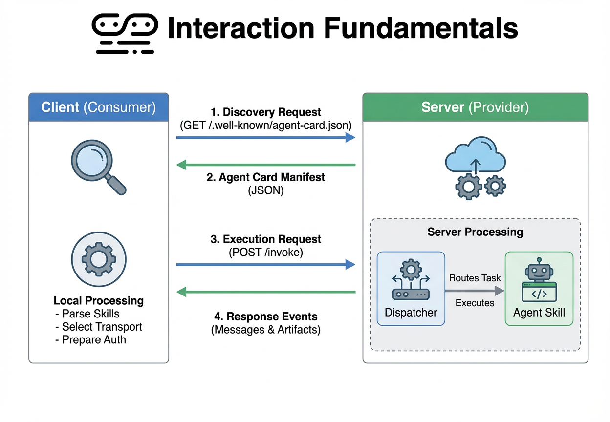

# A2A (Agent-to-Agent) Protocol Overview

A2A is a communication protocol designed to enable seamless, discoverable, and task-oriented interactions between AI agents and software services.

## Why A2A?

Traditional REST/HTTP APIs are often too rigid for the dynamic nature of AI agents. A2A addresses this by providing:
*   **Self-Discovery**: Services describe themselves so agents can understand their capabilities without manual integration.
*   **Contextual state**: Built-in support for long-running tasks and multi-turn conversations.
*   **Rich Outputs**: Standardized ways to return not just text, but structured data and file artifacts.

## Core Interaction Flow

The following diagram illustrates how a client discovers and interacts with an A2A service:

### 1. Discovery
The client starts by fetching the `AgentCard` from a well-known path. This card serves as the service's "resume," listing its name, supported transports, and available skills.

### 2. Negotiation
Based on the Agent Card, the client chooses the best transport (e.g., JSON-RPC for simplicity, gRPC for performance) and prepares the necessary authentication tokens.

### 3. Execution (The Task)
The client sends a `Message` to the server. The server dispatches this to a specific **Skill**.

---

## Skill Dispatching: How Intent is Found

A2A allows for flexible mapping between a user's natural language and the actual code that runs.

### Manual Dispatch
A simple `switch` or `if/else` block in the `AgentExecutor`. 
*   *Pros*: Fast, low cost, deterministic.
*   *Cons*: Limited to specific keywords; doesn't handle nuance well.

### AI-Based Dispatch (Intent Detection)
The server uses an LLM (like Gemini) to act as a "Router."
1.  **Context**: The LLM is provided with the `Skills` list from the **Agent Card**.
2.  **Analysis**: The LLM compares the user's message against the skill descriptions and examples.
3.  **Selection**: The LLM returns the most appropriate `SkillID`.
4.  **Routing**: The server executes the logic for that specific ID.

By using the **Agent Card** as the source of truth, you ensure that your routing logic automatically stays in sync with your service's declared capabilities.

---

## Deep Dive: Tasks & Artifacts

### Tasks and State
Unlike a REST request which is a single "hit," an A2A interaction is a **Task**.
*   **Asynchronicity**: A task can transition through states: `submitted` -> `working` -> `completed` (or `failed`/`rejected`).
*   **Status Updates**: While a task is `working`, the server can send multiple `TaskStatusUpdateEvent` objects. These provide "heartbeats" or progress messages (e.g., "Step 2/5: Analyzing data...") to keep the client informed during long-running operations.
*   **Resubscription**: If a network connection drops, the client can use the `TaskID` to resubscribe to the event stream, ensuring no progress or results are lost.

### Artifacts (The Deliverables)
An **Artifact** is the formal output of a Task. While **Messages** are for conversation, **Artifacts** are for data.
*   **Machine Consumable**: Artifacts often contain structured data (`DataPart`) or files (`FilePart`), making it easy for other agents or software tools to process the result programmatically.
*   **Decoupling**: By returning a JSON blob as an Artifact rather than a text message, you avoid requiring the client to "scrape" the agent's chat response to find the data.
*   **Multi-modal**: A single task can produce multiple artifacts (e.g., a summary document AND a raw data spreadsheet).

---

## Messages vs. Tasks: Result Types

In A2A, a service can respond in two distinct ways depending on the complexity of the skill:

### 1. Stateless Message Result
*   **Behavior**: The server returns an `a2a.Message` directly.
*   **Analogy**: A quick Q&A.
*   **Best For**: Instant actions, simple queries, or when you don't need to track a "process."
*   **Client View**: The interaction is finished as soon as the message is received.

### 2. Stateful Task Result
*   **Behavior**: The server returns a `TaskStatusUpdateEvent` (often starting with `working`).
*   **Analogy**: A work order or project.
*   **Best For**: Long-running jobs (Research, Video Processing), multi-turn conversations, or producing **Artifacts**.
*   **Client View**: The client receives a `TaskID` and can track progress heartbeats until a `completed` state is reached.

**Note**: Even if a task is short, returning it as a **Task** (by sending a final status update) is recommended if you want the client to be able to **reference** the result later using its ID.

---

## Key Terms

| Term | Definition |
| :--- | :--- |
| **Agent Card** | A JSON manifest describing an agent's identity and capabilities. |
| **Skill** | A discrete unit of functionality (e.g., "Check Weather"). |
| **Task** | A stateful unit of work that can span multiple messages. |
| **Message** | The primary unit of communication (User vs Agent roles). |
| **Artifact** | A structured output generated by a task (File, Data, etc.). |
