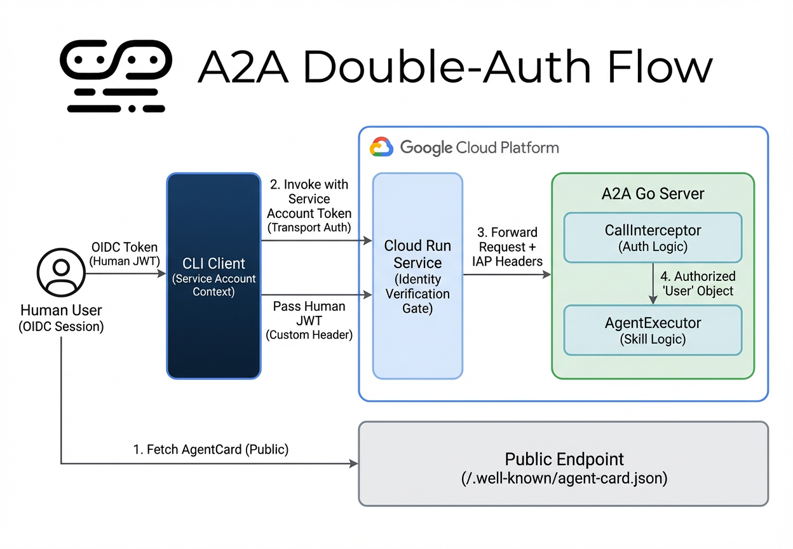

# A2A Authentication & Authorization Guide

This document explains how to secure A2A (Agent-to-Agent) services, focusing on delegated identity and secure remote access within the Google Cloud ecosystem.

## 1. Core Architecture: The "Double-Auth" Pattern

In secure enterprise environments, knowing *which machine* is calling you is not enough. You also need to know *which human* that machine is acting on behalf of. This is the **Double-Auth** pattern.

### The Two Layers
1.  **Transport Security (The "Front Door")**: 
    Verifies that the client machine (CLI, App, or another Agent) has permission to reach your server. In GCP, this is handled by **IAM** and **Service Account ID Tokens**.
    
2.  **Application Authorization (The "Skill Gate")**: 
    Verifies the human user's identity and roles to decide if they can execute a specific **Skill**. This is handled by **OIDC/JWT tokens** passed within the A2A protocol metadata.

---

## 2. Discovery: Public vs. Private

A common concern is discovery: "If my service is protected, how can other agents find me?"

### The Pattern: Public Card, Private Invoke
*   **Public Discovery**: You host your `AgentCard` at `/.well-known/agent-card.json` on a public URL. This contains your name, description, and the list of available skills.
*   **Private Execution**: The `URL` inside your `AgentCard` points to a protected endpoint (e.g., `https://my-service.a.run.app/invoke`). 

This allows other agents to discover what you *can* do without being able to actually *do* anything until they authenticate.

---

## 3. Implementation in GCP

For a "rational" implementation in the Google Cloud ecosystem, we recommend the following:

### A. Hosting on Cloud Run
*   **Configuration**: Deploy your A2A server to Cloud Run with "Require authentication".
*   **Client Auth**: The A2A Client (or CLI) uses its local credentials to generate a Google ID Token. It adds this to the `Authorization: Bearer <token>` header.
*   **Result**: Google's infrastructure verifies the token. If valid, the request is forwarded to your Go code.

### B. Handling Human Identity (Delegated Auth)
To restrict specific skills to certain users:
1.  **Client-side**: The CLI performs a login (e.g., using Firebase Auth or Identity Platform) to get a **Human JWT**.
2.  **A2A Protocol**: The client adds this JWT to a custom A2A metadata header (e.g., `X-End-User-Identity`).
3.  **Server-side Interceptor**: 
    *   Your A2A `CallInterceptor` extracts the `X-End-User-Identity` header.
    *   It validates the JWT against your Identity Provider.
    *   It populates an `AuthenticatedUser` object in the context.
4.  **The Skill Check**: Inside your `Execute` method, you check the user's roles before performing the action.

---

## 4. A2A Protocol Gating

A2A allows you to be dynamic about what you expose:

*   **Skill Security**: You can declare in the `AgentCard` that a specific skill requires `bearerAuth`. A2A-compliant clients will see this and know they must provide a token to use that skill.
*   **Extended Agent Cards**: If `SupportsAuthenticatedExtendedCard` is true, you can serve a "public" card to anonymous users and a "private" card (with more skills) to authenticated users via the `GetAgentCard` method.

---

## 5. Summary of Best Practices

1.  **Never hardcode secrets**: Use OIDC and Managed Identities (Service Accounts).
2.  **Decouple Auth from Logic**: Use the **Skill Provider Pattern**. Your business logic should just receive a `User` object and shouldn't care how that user was authenticated.
3.  **Standardize Metadata**: Use standard headers for identity propagation to ensure your A2A service can interact with other standard tools in the ecosystem.
